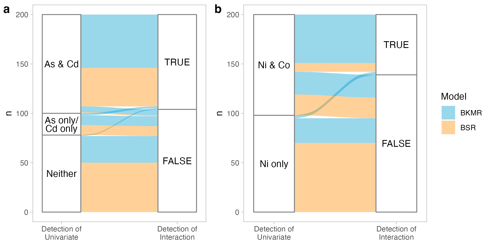
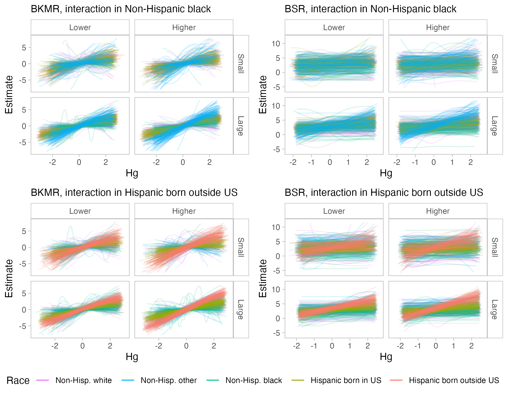

---
output:
  pdf_document: default
  html_document: default
---
# Simulations {#sims}

```{r include_packages2, include = FALSE}
library(knitr)
library(kableExtra)
library(tidyverse)
```

## Past simulation studies

Here, we preface our simulation study with an overview of examples in the literature which compare various methods for exposure mixture studies using simulations. @taylor_statistical_2016 conclude that, in general for exposure mixture studies, no single method consistently outperforms others across all situations and, importantly, that a method should be chosen based on the question of interest. Thus, for each study, we highlight not only the findings, but also the data-generating scenarios and the identified question of interest. 

@lazarevic_performance_2020 compare the performance of a broad range of methods for accurate variable selection of important exposures. They simulated exposure data using a multivariate copula based on real-world data and the response by specifying a regression model with only a subset of truly significant exposures and a normal error term. Two correlation structures were considered — one with the original Spearman correlation matrix and one with the values halved — as well as two signal-to-noise ratios — one with an $R^2$ for the true model at 10\% and one at 30\%. They found that BKMR, along with three other flexible regression methods that allow for nonlinearity, provided more accurate variable selection results compared to two machine learning methods. Moreover, they observed that, in general, low signal-to-noise ratios had a stronger impact on performance than did increasing multicollinearity. 

@hoskovec_model_2021 compare Bayesian methods, including BKMR, while considering 4 research questions: accurate estimation, selection of important exposures, exclusion of unimportant exposures, and identification of interactions. They use observed exposure and covariate data to simulate response data using regression relationships; they considered three exposure-response scenarios of varying complexity and included two-way multiplicative interaction terms. For each simulated dataset, they randomly assigned exposures to be active components of the mixture to incorporate variability in the data. Overall, they found that Bayesian methods outperformed traditional linear regressions, and that BKMR performed best when the exposure-response function takes on a complex form. 

Most recently, @pesenti_comparative_2023 compare BKMR, BSR, and the Bayesian Least Absolute Shrinkage and Selection Operator (LASSO) for variable selection. Data were generated using a multivariate normal with moderate and strong correlation structures specified manually by the researchers. They found that, in situations with additive and linear exposure-response relationships, Bayesian LASSO was appropriate. Across the other scenarios, BKMR generally performed best, while BSR selected exposures with high heterogeneity when the sample size was smaller due to the influence of the degrees of freedom, $d$, tuning parameter. Notably, multicollinearity did not generally lead to spurious variable selection. 

Finally, we briefly comment on studies by @sun_statistical_2013 and @barrera-gomez_systematic_2017, whose explicit goal is to compare methods for identifying interactions. Both studies generate exposure data using the correlation structure from an existing dataset; @sun_statistical_2013 uses a multivariate lognormal, while @barrera-gomez_systematic_2017 uses a multivariate normal. Both only consider two-way, multiplicative interactions. While neither of these studies consider the methods used in this thesis, they find that, in general, models that formally allow for interaction effects perform better than models that only allow for univariate additive effects. 

## Methods {#methods}

The goal of our simulation study is to provide guidance on the choice between BSR and BKMR for characterizing a diverse range of complex interactions between predictors. In particular, we aim to extend findings from previous simulation studies by considering a more comprehensive range of interaction types, including different effect sizes, non-multiplicative interactions, and three-way interactions. We also explore interactions between exposures and categorical covariates, a previously understudied form of interaction in exposure mixture studies. Hereafter, we refer to exposures and chemicals interchangably. 

### MADRES data {#madres}

In order to make our simulations comparable to real-world exposure mixture studies, we based our simulation data on the Maternal And Developmental Risks from Environmental and Social Stressors (MADRES) pregnancy cohort. The MADRES cohort is an ongoing, prospective pregnancy cohort of predominantly lower-income, Hispanic women in Los Angeles, California, which began in 2015 [@bastain_study_2019]. Urine samples were collected by participants at their first visit, and questionnaires were administered during their first visit, with follow-ups at the first, second, and third trimesters. See @bastain_study_2019 for further details on study design. 

@howe_prenatal_2020 previously examined the effect of prenatal metal mixtures of birth weight (BW) for gestational age (GA) in this cohort. They used BKMR to identify associations between metal mixtures and BW for GA, as well as BSR to conduct inference on interactions between metals. Using BKMR, they found that, of the metals in the mixture, mercury and nickel were most strongly associated with BW for GA. Moreover, BKMR results suggested that a potential interaction between mercury and nickel exists; however, when run through BSR, the PIP for this interaction was extremely small, despite being the highest of all two-way interactions. 

Data from the study by @howe_prenatal_2020 were obtained from publicly available data in the Human Health Exposure Resource (HHEAR) Data Repository, which has been approved under Icahn School of Medicine at Mount Sinai IRB Protocol #16-00947. The Digital Object Identifiers associated with the urinary trace element data and epidemiological data are 10.36043/1945_159 and 10.36043/1945_177, respectively. All analyses were conducted in R v4.3.2 [@r_core_team_r_2013].

```{r logtransf, fig.cap="Distributions of original (a) and natural log transformed (b) concentrations of metals in MADRES cohort (n=252).", out.width = '90%', echo = FALSE}
include_graphics(path = "figures/ch4_univlog.png")
```


We followed the approach by @howe_prenatal_2020 for preparing the data for analysis. This resulted in retaining 10 metals in analysis: arsenic (As), cadmium (Cd), cobalt (Co), mercury (Hg), nickel (Ni), molybdenum (Mo), lead (Pb), antimony (Sb), tin (Sn), and thallium (Tl). @howe_prenatal_2020 used speciated As, but this was not available in HHEAR, so we used total As. Metals were expressed in nanograms per milliliter (ng/mL) and natural log transformed to reduce right-skewness (Figure \@ref(fig:logtransf)). Among the full range of covariates considered by @howe_prenatal_2020, we used the subset of 4 that were available in HHEAR: any smoke exposure during pregnancy, maternal prepregnancy body mass index (BMI), maternal age during firt trimester, and maternal race by ethnicity and birth place. We chose not to include study site, as there was a study site with only 1 participant. Race by ethnicity and birth place was collapsed into the following categories: non-Hispanic white, non-Hispanic black, non-Hispanic other, Hispanic born in the US, and Hispanic born outside the US. We observed 8 missing values for BMI in the data from HHEAR, which were not reported by @howe_prenatal_2020. We mean imputed these missing values. Distributions of covariates are shown in Figure \@ref(fig:covdist). Our final analytic dataset included 252 participants, which was 10 fewer than in @howe_prenatal_2020, likely due to small discrepancies in their dataset and the one made available in HHEAR. 

```{r covdist, fig.cap="Distributions of continuous (a) and categorical (b) covariates in the MADRES cohort (n=252).", out.width = '75%', echo = FALSE}
include_graphics(path = "figures/ch4_covdist.png")
```


### Using copulas to simulate predictor data {#copula}

We simulated exposure and covariate data (hereafter referred to collectively as predictors) using a multivariate Gaussian copula fit on the 252 participants in the MADRES cohort. We used copulas as they can preserve both the correlation structure and marginal distributions from the observed data, allowing us to replicate conditions in a real-world scenario. 

First, we briefly introduce copulas in the context of their use in this simulation, based on the presentation in @nelsen_introduction_2006. Copulas are joint cumulative distribution functions (CDFs) defined on the unit cube $[0,1]^n$ that capture the dependence between $n$ uniformly distributed marginals. Sklar's theorem allows us to apply copulas to our observed data. Sklar's theorem states that, if $H(x_1, \dots x_n)$ is a joint CDF of the marginal CDFs $F_1(x_1), \dots, F_n(x_n)$, then there exists a copula $C$ such that, for all $(x_1, \dots, x_n)$ in $(X_1, \dots, X_n)$, 

$$
H(x_1, \dots x_n)=C(F_1(x_1), \dots, F_n(x_n)).
$$

\noindent Note that, by the probability integral transform, or the universality of the uniform, the CDFs $F_1(x_1), \dots, F_n(x_n)$ are distributed uniformly. 

We used the `copula` package in R to fit copulas and generate random data [@hofert_copula_2023]. We transformed the observed continuous predictor values to uniform distributions based on their empirical marginal CDFs, a process called generating "pseudo-random" samples. We used the checkerboard copula approach for generating pseudo-random samples for smoke exposure, a binary variable [@genest_primer_2007]. We coded smoke exposure as 0's and 1's, generated a pseudo-random sample, and then "jittered" the values with uniform random noise. There is currently no widely accepted approach for generating pseudo-random samples from unordered categorical variables with more than two levels. Thus, we excluded race by ethnicity and birthplace from the copula model. While this means that our simulated datasets did not preserve any potential association between race and exposures, Figure \@ref(fig:raceexp) suggests that there is little to no visible association between race and exposures in the observed dataset. 

```{r raceexp, fig.cap="Association between race by ethnicity and birth place and metal exposures in the MADRES cohort (n=252).", out.width = '80%', echo = FALSE}
include_graphics(path = "figures/ch4_race_exp.png")
```

Various families of copulas have been described, each of which specifies a different shape for the dependence structure. We performed model selection to identify the copula that best approximates the dependence structure of our data. We fit the set of multivariate copulas used by @lazarevic_performance_2020 in their simulation study, which included the Gaussian, $t$, Gumbel, Frank, Clayton, and Joe copulas. We fit two $t$ copulas with 4 and 10 degrees of freedom, which controls dependence at the tails of the distributions, as well as a $t$ copula where the degrees of freedom was determined during the fitting process. The Gumbel, Frank, Clayton, and Joe copulas require a $\theta$ parameter, which controls dependence between the distributions. We fit two versions of these copulas with $\theta=\{2, 4\}$. Among these, the Gaussian copula minimized the Akaike information criterion and maximized the likelihood, so we proceeded with this model. The Gaussian copula assumes a bivariate normal dependence structure between the marginal CDFs. 

```{r univexpsim, fig.cap="Distributions of log-transformed exposures from observed data (blue) and 2100 simulated smaller size (n=252) datasets (gray).", out.width = '75%', echo = FALSE}
include_graphics(path = "figures/ch4_univ_exp_sim.png")
```


```{r univcovsim, fig.cap = "Distributions of continuous (a) and categorical (b) covariates from observed data (blue) and 2100 simulated smaller size (n=252) datasets (gray).", out.width = '75%', echo = FALSE}
include_graphics(path = "figures/ch4_univ_cov_sim.png")
```

We simulated predictor data by randomly sampling from the fitted multivariate Gaussian copula distribution. All pseudo-random samples were then back-transformed to their original distributions using empirical marginal CDFs. We simulated the race by ethnicity and birthplace variable by randomly assigning observations to each of the five categories based on proportions in the observed dataset. 

```{r corsimssm, fig.cap = "Spearman's correlation heat maps of exposures from observed data (a) and averaged across 2100 smaller size (n=252) simulated datasets (b).", out.width = '100%', echo = FALSE}
include_graphics(path = "figures/ch4_corr_sim+orig.png")

# , as well as distribution of correlations from smaller size simulated datasets (c)
```

We generated one set of simulated datasets with the same sample size as the observed dataset (n=252), which is typical in many cohort studies. We also generated another set of simulated datasets with a larger sample size (n=1000), which has become increasingly common with the rise of larger-scale studies. The goal of this choice was to inform sample size considerations in study design. We verified that the original structure of the observed dataset were preserved by visually comparing univariate distributions of exposures (Figure \@ref(fig:univexpsim)) and covariates (Figure \@ref(fig:univcovsim)), as well as the correlation structure using Spearman's $\rho$ (Figure \@ref(fig:corsimssm)). Distributions of Spearman's correlation were approximately normal (Figure \@ref(fig:cordistsm)). Plots for the larger size simulated datasets were similar (Figures \@ref(fig:univexplg), \@ref(fig:univcovlg), and \@ref(fig:corsimslg)). 

### Simulating predictor-response relationships {#simresp}

Health outcome responses were simulated under several different scenarios, each of which included different effect sizes and functional forms for the interactions. All scenarios were run for both the smaller (n=252) and larger (n=1000) sample sizes. In the first scenario, we specified a "base case" model:

\begin{multline*}
Y = \textrm{Hg} + \frac{3}{1+\textrm{exp}(-4\textrm{Ni})} + \frac{1.5}{1+\textrm{exp}(-4\textrm{Sn})} - \textrm{Sb}^2 + 0.5\textrm{Sb}\\
+ \textrm{age} + 0.5\textrm{bmi} + 0.5\textrm{race}_{\textrm{black}} + 0.5\textrm{race}_{\textrm{hisp.non}} + 1.5\textrm{smoke} + \varepsilon,
\end{multline*}

\noindent where $\varepsilon \overset{\mathrm{iid}}{\sim} N(0,5)$. This model includes a linear term for Hg, two S-shaped logistic terms for Ni and Sn with varying effect sizes, and a symmetric inverse U-shaped quadratic term for Sb (Figure \@ref(fig:univlines)). Moreover, we included covariate terms as linear effects in the model. We chose the standard deviation on the normal random error term in order to achieve an $R^2$ of around 0.1-0.3 in a multiple linear regression that included only the true functional form of the significant chemicals (Figure \@ref(fig:rsqcheck)). This $R^2$ range approximates realistic signal-to-noise ratios in exposure mixture studies [@lazarevic_performance_2020]. 

In subsequent scenarios, we added an additional interaction term to the base case model. First, we considered interactions between two exposures. We defined four cases of interest: a two-way interaction between exposures that are univariately significant, a two-way interaction between exposures that are univariately insignificant, a two-way interaction between exposures that are moderately collinear, and a three-way interaction. For each case, we considered two functional forms — multiplicative and polynomial — and a lower and higher effect size, which we set by defining the weight on the interaction term in the model. The higher effect sizes were selected in order to achieve a power of approximately 0.5 at $\alpha=0.05$ in the smaller sample size (n=252) case, using a multiple linear regression with the true functional form of the chemicals specified and the covariate terms included. The lower effect sizes were set equal to half of the higher effect size. Table \@ref(tab:scenarios) shows the specification of interaction terms. See Appendix \@ref(suppmethods), Figures \@ref(fig:basesurf)-\@ref(fig:cp2), for 3D surfaces of the two-way interaction terms. 

```{r scenarios, echo = FALSE}
equations <- data.frame(
  type = rep(c("Multiplicative", "Polynomial"), 4), 
  small = c("0.35Hg$*$Ni", "0.13Hg$*($Ni$-1)^2$", 
            "0.35Cd$*$As", "0.125Cd$*($As$-1)^2$", 
            "0.3Ni$*$Co", "0.1Ni$*($Co$-1)^2$", 
            "0.3Hg$*$Ni$*$Tl", "0.09Hg$*($Ni$-1)^2*$Tl"), 
  large = c("0.7Hg$*$Ni", "0.26Hg$*($Ni$-1)^2$", 
            "0.7Cd$*$As", "0.25Cd$*($As$-1)^2$", 
            "0.6Ni$*$Co", "0.2Ni$*($Co$-1)^2$", 
            "0.6Hg$*$Ni$*$Tl", "0.18Hg$*($Ni$-1)^2*$Tl")
)
labels <- c(
  "Univariately significant" = 2, 
  "Univariately insignificant" = 2, 
  "Highly correlated" = 2, 
  "Three-way interaction" = 2
)

equations |> 
  kbl(booktabs = TRUE, escape = FALSE, 
      col.names = c("", "Lower", "Higher"), 
      align = "lcc",
      caption = "Specification of interaction terms in simulations.") |> 
  column_spec(1, width = "10em") |> 
  add_header_above(header = c(" " = 1, "Effect size" = 2)) |>
  pack_rows(index = labels) 
```

Next, we considered interactions between the race by ethnicity and birthplace covariate (hereafter referred to as race for concision) and an exposure. We are interested in cases where the health effects of an exposure are higher in one group compared to the rest. In a real-world scenario, such interactions can arise from excess amounts of social stress experienced by a group due to racism. To model this, we increased the coefficient Hg in Non-Hispanic Black individuals (n=27 in the original MADRES cohort) for the first scenario, and in Hispanic individuals born outside the US (n=109 in the original MADRES cohort) for the second scenario. The goal of this choice was to assess the impact of group size on detectability of an interaction, and to quantify the potential value of oversampling the minority group. For each scenario, we specified a lower effect size by increasing the coefficient on Hg by $1.5\times$ (i.e. from $1*$Hg to $1.5*$Hg) in the target group, and a higher effect size by increasing the coefficient on Hg by $2\times$ (i.e. from $1*$Hg to $2*$Hg). 

This resulted in a total of 42 scenarios ([1 base case + 5 interaction cases $\times$ 2 effect sizes $\times$ 2 functional forms] $\times$ 2 sample sizes = 42). For each scenario, we generated 100 simulated datasets to fit our models on, resulting in a total of 4200 datasets. Hereafter, we refer to the two different effect sizes of interactions using "lower" and "higher," and we refer to the two different sample sizes as "small" and "large," or "smaller" and "larger."

<!-- We hypothesize that... [*add hypothesis*] -->

### Models {#models}

We ran four methods on our simulated datasets. All metal concentrations and continuous covariates were standardized in analysis to keep values scale-free. 

To get a baseline, we ran a multiple linear regression, including all exposures and covariates as linear, additive terms in the model. We refer to this model as the naive MLR. Then, we ran a multiple linear regression with the true model explicitly specified by excluding non-significant exposures and specifying the known form of non-linear terms and non-additive interactions. We refer to this model as the oracle MLR. In scenarios with an interaction between race and Hg, we collapsed race into a binary variable indicating whether or not the original race category was interacting with Hg before running oracle MLR's, in order to simplify the detection of the interaction. 

Next, we ran BKMR using the `bkmr` package in R [@bobb_statistical_2018; @bobb_bkmr_2022]. We chose to implement component-wise variable selection rather than hierarchical selection to make simulation results more interpretable, and because there was only moderate multicollinearity in the observed and simulated data. We specified the default priors [@bobb_bayesian_2015, and as listed in Chapter \@ref(bkmrprior)], which is common in the literature for BKMR [e.g., @lazarevic_statistical_2019, @howe_prenatal_2020, @pesenti_comparative_2023]. We ran the MCMC sampler for 50,000 iterations, as recommended by @bobb_statistical_2018, and discarded the first 25,000 iterations for burn-in. BKMR does not provide the option to run multiple chains or to thin chains. For larger size datasets, we sped up computations by employing a Gaussian predictive process on 100 knots specified evenly across the predictor space. 

We ran BSR using the `NLinteraction` package in R [@antonelli_nlinteraction_2018]. We specified the default priors [@antonelli_estimating_2020, and as listed in Chapter \@ref(bsrprior)], which is common in the literature for BSR [e.g., @howe_prenatal_2020; @pesenti_comparative_2023]. @antonelli_estimating_2020 suggests separately fitting models for degrees of freedom $d=\{1, 2, 3, 4\}$ and selecting the value for $d$ which minimizes WAIC. We used the default Gibbs sampler, as opposed to the Metropolis Hasting sampler. Due to time constraints in this thesis, we first fit BSR on the grid of values for $d$ using 5,000 MCMC iterations to obtain the empirical Bayes estimate for $\sigma^2_{\boldsymbol\beta}$ and then another 5,000 MCMC iterations to obtain the posterior distributions, discarding the first 2,500 iterations for burn-in each time. We selected $d$ based on the WAIC criterion on these preliminary models. Then, we fit the full BSR model using 50,000 MCMC iterations to obtain the empirical Bayes estimate and then another 50,000 MCMC iterations to obtain the posterior distributions, discarding the first 25,000 iterations for burn-in each time. We ran two chains to verify convergence, thinning each chain by selecting every 8th iteration to reduce autocorrelation based on default settings. In a small test run on five smaller size datasets for each scenario containing interactions between exposures, as well as the base case, we found that using 5,000 iterations selected the same degrees of freedom as using 50,000 iterations 86\% of the time (see Appendix \@ref(suppmethods), Figure \@ref(fig:comparedf)). 

Finally, we ran stratified BKMR and BSR models in scenarios where we simulated an interaction between race and Hg. This involved running five separate models for each race category, each with the same settings specified above. For the smaller size datasets, we often observed convergence issues in BKMR within the smaller race categories. As such, for smaller size datasets, we also assess the impact of collapsing the three smaller race categories (Non-Hispanic white, black, and other) into one category before stratifying. This is a common practice in real-world studies where sample sizes for certain categories are low. 

<!-- - expect that there will be less power to detect these interactions, especially in smaller size datasets -->

For all models, we saved run-times for the fitting process on the high-performance computing cluster. Due to an error in our code and time constraints in this thesis, we were not able to obtain run times for stratified BSR models. We checked convergence for a selection of BKMR and BSR models using trace plots (Appendix \@ref(suppresults), Figure \@ref(fig:traceplots)). 

### Model assessment 

We assessed model performance based on detection of significant univariate chemicals as well as detection of interactions. For the naive and oracle MLRs, we considered a $p$-value less than 0.05 to indicate detection of a significant term. For BKMR and BSR, we used the median probability model, which considers a PIP greater than or equal to 0.5 to indicate detection of a significant term [@barbieri_optimal_2004]. 

While BSR provides PIP's to quantify detection of interactions, BKMR does not. As such, for BKMR, we considered formal detection of an interaction based on confidence intervals constructed around the estimated response. Specifically, we first calculated the difference in estimated response at a chemical's 0.25 and 0.75 quantiles. Then, we assessed whether this quantity differed at the 0.25 and 0.75 quantiles of one (or two, for three-way interactions) other chemicals in the interaction, while holding all other chemicals at their 0.5 quantiles, by constructing a 95\% confidence interval of the difference in differences. We followed the code in the `SingVarIntSummaries()` function in the `bkmr` package for constructing confidence intervals [@bobb_bkmr_2022]. Notably, for two-way interactions, the ordering of the chemicals in this comparison does not matter. To see why, see \@ref(eq:confinteq) in Appendix \@ref(suppmethods). However, for three-way interactions, the order does matter. Thus, we considered a three-way interaction to be detected if at least one of the three confidence intervals was significantly greater than zero. We used the Bonferroni correction to adjust for multiple comparisons, creating 98.3\% confidence intervals to achieve an overall 95\% confidence level [@dunn_multiple_1961; @vanderweele_desirable_2019]. 

For both BKMR and BSR, we also visually assessed detection of interactions by plotting the estimated exposure-response surface for one chemical while fixing one (or two, for three-way interactions) other chemicals at their 0.1, 0.5, and 0.9 quantiles. In all scenarios, we calculated the sensitivity as the proportion of times a significant term was correctly detected. Due to time constraints in this thesis, we only calculated the false discovery rates, or, the proportion of times a significant term is incorrectly detected, for two-way interactions between chemicals. 

<!-- Future work should include the calculation of false discovery rates for all interactions.  -->

For stratified models, we compared the estimated response across each separate model. Specifically, for BKMR, we computed a confidence interval for the difference in estimated response at the 0.25 and 0.75 quantiles of Hg on each subcategory of race, following the code in the `SingVarRiskSummaries()` function in the `bkmr` package [@bobb_bkmr_2022]. We adjusted for multiple comparisons based on the Bonferroni procedure by constructing 5 simultaneous 99\% confidence intervals, in order to achieve an overall 95\% confidence level [@dunn_multiple_1961; @vanderweele_desirable_2019]. We considered an interaction as correctly detected if (1) there was at least one overlap between the target group's confidence interval and all other confidence intervals, and (2) all other confidence intervals overlapped. 

<!-- We note that there was separation with all groups in only 4 cases. 
For instance, if the confidence intervals for the estimated magnitude of response were all (-1, 1) for the first four categories, but the fifth category had a confidence interval of (2, 4), we would consider the effect of Hg to be significantly higher in this group.  -->

However, for BSR, we were not able to find a method in the literature for combining variances from estimated responses at two different sets of predictor values. While the kernel machine regression method used by BKMR generates a covariance matrix for estimates at various predictor values, which are then used to generate confidence intervals, the same is not true for the spline regression method used by BSR. Therefore, we visualized and compared the estimated exposure-response relationship in each of the stratified models as a qualitative way to assess for interactions. We also generated these diagnostic plots for BKMR. Moreover, due to time constraints in this thesis, we only considered sensitivity, as opposed to also considering false discovery rates. 

<!-- Future work should involve exploring methods for estimating contrasts along continuous predictors for a more formal method of inference on BSR output, as well as consideration of false discovery rates. -->

See Appendix \@ref(extractresults) for the code we wrote to extract some of the aforementioned results from BKMR and BSR, as some functions were not directly available from the `bkmr` and `NLinteraction` packages [@bobb_bkmr_2022; @antonelli_nlinteraction_2018]. 

## Results {#results}

### Base case

We start by presenting results from models run on the base case scenario, in which the true relationship contained no interactions. Figure \@ref(fig:basecasesig) displays the distribution of p-values and PIPs from this scenario, while Table \@ref(tab:basecasetab) summarizes model sensitivity and false discovery rates based on these values. Note that insignificant chemicals were not included in the oracle MLR, which is why their distributions are omitted from this output. 

```{r basecasesig, fig.cap = "P-value distributions from smaller (a) and larger (b) size datasets and PIP distributions from smaller (c) and larger (d) size datasets.", out.width = '100%', echo = FALSE}
include_graphics(path = "figures/ch4_basecasesig.png")
```

```{r basecasetab, echo = FALSE, message = FALSE}
base_sens <- read_csv("data/base_sens.csv")

base_sens2 <- base_sens |> 
  mutate(var = gsub("[^[:alpha:]]","", var), 
         mod = factor(mod, levels = c("Naive MLR", "Oracle MLR", "BKMR", "BSR"))) |> 
  arrange(desc(sign), var, mod, desc(size)) |> 
  select(-sign) |> 
  pivot_wider(names_from = var, values_from = sensitivity)

base_mod_ord <- table(base_sens2$mod)

options(knitr.kable.NA = '-')
base_sens2 |> 
  select(-mod) |> 
  kbl(booktabs = TRUE, escape = FALSE, 
      col.names = c("", names(base_sens2)[3:12]),
      align = "lcccccccccc",
      caption = "Sensitivity and false discovery rate (FDR) of chemicals in base case scenario.") |> 
  column_spec(1, width = "6em") |>
  add_header_above(header = c(" " = 1, "Sensitivity" = 4, "FDR" = 6)) |>
  pack_rows(index = base_mod_ord) 
```

The strongest detected effects in the naive MLR come from Hg, with a sensitivity of 0.8 and 1 in the smaller and larger size datasets, respectively. This is likely because Hg is the only linear term in the model. Ni and Sn have an S-shaped curve with higher and lower effect sizes, respectively, so the naive MLR detects a slight linear signal from them. Sb, which has a U-shaped curve, is the hardest to pick up. On the other hand, the oracle MLR consistently detects Hg, Ni, and Sb. The smaller size oracle MLRs only occasionally pick up Sn, likely due to the lower effect size. 

BKMR has similar sensitivity rates as the oracle MLR, ranging from 0.52-0.95 in the smaller size datasets and 0.77-1.00 in the larger size datasets. However, BKMR also has, by far, the highest false discovery rates, ranging from 0.30-0.41 in the smaller size datasets and 0.08-0.14 in the larger size datasets. This is likely due to the default choice of an inverse uniform distribution from 0 to 100 for the "slab" component on the "slab-and-spike" prior on $r_m$. Choosing a prior that assigns higher probability to smaller values of $r_m$ should reduce the false discovery rate. In contrast, BSR tends to have slightly lower sensitivity rates than BKMR, raning from 0.17 to 0.88 in the smaller size datasets and 0.62-1.00 in the larger size datasets, but the false discovery rates are much lower, ranging from 0.04-0.05 in the smaller size datasets and 0-0.03 in the larger size datasets. 

<!-- Together, this suggests that the default prior choices provided by BSR are likely a better fit for this scenario.  -->

Overall, this base case scenario confirms that the multiple regression and Bayesian models behave as expected. We also recognize that, for univariate significance metrics, BKMR tends to produce higher sensitivity and false discovery rates, while the opposite is true for BSR. 

### Univariate sensitivity {#univsenschap}

Now, we provide a brief overview of univariate sensitivity metrics from all scenarios with an interaction between chemicals. We are particularly interested in cases where it appears that the inclusion of an interaction term influences the detection rate of univariate chemicals. 

<!-- # ```{r hgniuniv, fig.cap = "P-value (a) and PIP (b) distributions for univariate chemicals from all models in scenarios with an interaction between Hg and Ni.", out.width = '100%', echo = FALSE} -->
<!-- #  -->
<!-- # ``` -->

Table \@ref(tab:onewaytabsens) summarizes the sensitivity of univariate chemicals in all scenarios with interactions between chemicals, comparing the form of interactions, effect sizes, size of datasets, and models. See Table \@ref(tab:onewaytabfdr) in Appendix \@ref(suppresults) for false discovery rates, as well as Figures \@ref(fig:nsmunivp)-\@ref(fig:slgunivp) in Appendix \@ref(suppresults) for the full p-value and PIP distributions for all scenarios with interactions between chemicals. 

```{r onewaytabsens, echo = FALSE, message = FALSE}
naive_sens <- read_csv("data/naive_sens.csv")
oracle_sens <- read_csv("data/oracle_sens.csv")
bkmr_sens <- read_csv("data/bkmr_pip_sens.csv")
bsr_sens <- read_csv("data/bsr_pip_sens.csv")

comb_sens <- bind_rows(
  rename(naive_sens, variable = var),
  filter(select(oracle_sens,-var), variable != "Int"),
  mutate(bkmr_sens, mod = "BKMR"),
  mutate(bsr_sens, mod = "BSR")
) |>
  filter(case != 1) |>
  mutate(
    variable = gsub("[^[:alpha:]]", "", variable),
    mod = factor(mod, levels = c("Naive MLR", "Oracle MLR", "BKMR", "BSR")) ,
    sign = ifelse(mod == "Oracle MLR", TRUE, sign),
    new_sign = factor(ifelse(
      variable %in% c("Hg", "Ni", "Sb", "Sn"),
      "Sen",
      "FDR"
    ), levels = c("Sen", "FDR")), 
    cond = case_when(
      case %in% 2:5 ~ "Hg-Ni",
      case %in% 6:9 ~ "Cd-As",
      case %in% 10:13 ~ "Ni-Co", 
      .default = "Hg-Ni-Tl"
    ),
    cond = factor(cond, levels = c("Hg-Ni", "Cd-As", "Ni-Co", "Hg-Ni-Tl")), 
    inter_type = ifelse(case %% 4 %in% 1:2, "Mult.", "Poly."),
    effect_size = factor(
      ifelse(case %% 2 == 1, "Higher", "Lower"),
      levels = c("Lower", "Higher")
    )
  ) |>
  group_by(cond, inter_type, effect_size, mod, size, new_sign) |> 
  summarize(detection = mean(sensitivity)) |> 
  arrange(new_sign, desc(size)) |> 
  pivot_wider(names_from = c(mod, size, new_sign), values_from = detection, 
              names_sep = " ") |> 
  ungroup()

comb_sens_ord <- table(comb_sens$cond)

# options(knitr.kable.NA = '-')
comb_sens |> 
  select(-cond) |> 
  select(1:10) |> 
  kbl(booktabs = TRUE, digits = 2, #align = "lcc",
      caption = "Overall sensitivity for univariate chemicals in all scenarios with interactions between chemicals. Multiplicative and polynomial are abbreviated mult. and poly., respectively.", 
      col.names = c("Type", "Effect size", 
                    rep(c("Naive", "Oracle", "BKMR", "BSR"), 2))
      ) |> 
  add_header_above(header = c(" " = 2, "Small (n=252)" = 4, "Large (n=1000)" = 4), bold = TRUE) |>
  pack_rows(index = comb_sens_ord) 
```

In general, the detection rates of univariate chemicals that participate in an interaction differ in comparison to the base case. First, we briefly note that the sensitivity for univariate chemicals that participate in interactions is reduced for oracle MLRs, compared to the base case (Table \@ref(tab:onewaytabsens) and Figures \@ref(fig:osmunivp) and \@ref(fig:olgunivp)). However, as the oracle MLRs contain explicit interaction terms, the p-values for univariate terms that participate in an interaction are not interpretable. 

<!-- In general, the detection rates of univariate chemicals in naive MLRs are not affected by the inclusion of interaction terms, in comparison to the base case (Table \@ref(tab:onewaytabsens) and Figures \@ref(fig:nsmunivp) and \@ref(fig:nlgunivp)).  -->

Now, for the naive MLR, BKMR, and BSR, chemicals that are marginally insignificant but participate in an interaction can occasionally be detected, depending on their form, effect size, and the sample size of the data. For instance, in scenarios with a higher effect polynomial interaction between As and Cd, both of which are univariately insignificant, the larger size naive MLR has a sensitivity of 0.67 for Cd (Figure \@ref(fig:nlgunivp)), BKMR 0.78, and BSR 0.55. In comparison, the sensitivities are all lower in scenarios with the higher effect multiplicative interaction between As and Cd. This is likely because, in the theoretical model for this scenario, Cd exhibits a strong positive relationship with the health response at lower levels of As, which is then attenuated at higher levels of As (Figure \@ref(fig:bp2)). On the other hand, in the case of a multiplicative interaction, the positive relationship between Cd and the health response at lower levels of As becomes inverted at higher levels of As (Figure \@ref(fig:bm2)), which would be more difficult to detect when only considering additive effects. This demonstrates that non-additive interactions may occasionally be detected through univariate terms depending on their form, and when the effect size and sample size are large enough.

Finally, univariate sensitivity for chemicals that are marginally significant — in our case, Hg and Ni — are not noticably affected by participation in an interaction. For instance, the naive MLR, BKMR, and BSR had sensitivities of 0.80, 0.86, and 0.51, respectively, for Hg in the base case with the smaller size dataset. In scenarios with a higher effect size multiplicative interaction between Hg and Ni, the sensitivities were 0.77, 0.88, and 0.58 for the naive MLR, BKMR, and BSR, respectively. As such, we confirm that participation in an interaction does not affect univariate sensitivity, in our simulation scenarios. 

The findings from this section suggest the impact of interpreting univariate effects from models without considering potential interactions. If a chemical participates in an interaction but is, itself, not significant, then it can occasionally be detected as significant, depending on the form of the interaction, its effect size, and the sample size. On the other hand, if the chemical is itself significant, the detection of its effect should not be affected by the presence of an interaction. 

### Two-way interactions between chemicals

This section describes the ability of BKMR and BSR to detect two-way interactions between chemicals, using results from the oracle MLR as a baseline. We recall that sensitivities for BKMR were generated by the confidence interval approach, which required an arbitrary choice of the 0.75 and 0.25 quantiles for comparing the estimated response. On the other hand, sensitivities for BSR were based on the PIPs that it provides for interaction terms. 

Table \@ref(tab:twowaytab) summarizes the sensitivity of the oracle MLR, BKMR, and BSR for two-way interactions. The oracle MLR consistently has much greater sensitivity for interactions than both BKMR and BSR. First, we discuss smaller size datasets. At the lower effect size of interactions, the oracle MLR has sensitivities of 0.15-0.24, while BKMR and BSR have much lower sensitivities of 0-0.03, excluding BSR's sensitivity of 0.07 for the multiplicative interaction between Hg and Ni. Now, for the higher effect size interactions in the smaller size datasets, the oracle MLR has a sensitivity of around 0.5, which is as we designed. In comparison, for Hg and Ni, BKMR has sensitivities of only 0.11 and 0.03 for the multiplicative and polynomial interactions, respectively, while BSR has sensitivities of only 0.10 and 0.14. For interactions between Cd and As, and between Ni and Co, BKMR and BSR have sensitivities ranging from only 0-0.02. Therefore, in smaller size datasets, it is very difficult for BKMR and BSR to detect interactions, particularly when the effect size is low, or both chemicals are not marginally significant (which is the case for Cd and As and Ni and Co). 


```{r twowaytab, echo = FALSE, message = FALSE}
oracle_comb <- read_csv("data/oracle_sens.csv")
bkmr_comb <- read_csv("data/bkmr_int_sens.csv")
bsr_comb <- read_csv("data/bsr_int_sens.csv")

comb_int <- bind_rows(
  oracle_comb |> filter(variable == "Int") |> 
    select(-variable, cond = var), 
  bkmr_comb |> mutate(mod = "BKMR"), 
  bsr_comb |> mutate(mod = "BSR") |> filter(sign) |> rename(cond = inter2) |> select(-sign)
) |>
  filter(case %in% 2:13) |> 
  mutate(cond = gsub(":", "-", cond), 
         cond = gsub("\\+", "-", cond),
         cond = case_when(
           cond == "I(Hg * ((Ni - 1)^2))" ~ "Hg-Ni", 
           cond == "I(Cd * ((As - 1)^2))" ~ "Cd-As", 
           cond == "I(Ni * ((Co - 1)^2))" ~ "Ni-Co", 
           cond == "As-Cd" ~ "Cd-As", 
           cond == "Co-Ni" ~ "Ni-Co", 
           .default = cond
         ), 
         cond = factor(cond, levels = c("Hg-Ni", "Cd-As", "Ni-Co")), 
         inter_type = ifelse(case %in% c(2, 3, 6, 7, 10, 11), "Multiplicative", "Polynomial"), 
         effect_size = factor(ifelse(case %% 2 == 1, "Higher", "Lower"), 
                              levels = c("Lower", "Higher"))) |> 
  select(-case) |>
  arrange(desc(size)) |> 
  pivot_wider(names_from = c(mod, size), values_from = sensitivity, 
              names_sep = " ") |> 
  arrange(cond, inter_type, effect_size)

comb_int_ord <- table(comb_int$cond)

comb_int |> 
  select(-cond) |> 
  kbl(booktabs = TRUE, escape = FALSE, 
      align = "llcccccc", 
      caption = "Sensitivity to interactions in all scenarios with two-way interactions between exposures.", 
      col.names = c("Interaction type", "Effect size", rep(c("Oracle", "BKMR", "BSR"), 2))) |> 
  add_header_above(header = c(" " = 2, "Small (n=252)" = 3, "Large (n=1000)" = 3), bold = TRUE) |>
  pack_rows(index = comb_int_ord) |> 
  collapse_rows(columns = 1, valign = "middle", latex_hline = "linespace")
```


Now, in larger size datasets, interactions are detected much more frequently by BKMR and BSR. In general, for interactions between Hg and Ni, the sensitivities of BKMR and BSR have values around 0.2-0.3 less than those for the oracle MLR. As a result, for the higher effect size interactions, BKMR and BSR have relatively high sensitivites ranging from 0.76-0.88. While both do not achieve the sensitivity of 1 that the oracle MLR does, they can still detect these interactions relatively reliably. We also note that neither BKMR nor BSR consistently outperforms the other in this case — BSR would thus be more preferable as it has a more formal framework for conducting inference. 

In comparison, for interactions between Cd and As, which are both marginally insignificant, BKMR and BSR struggle to detect a significant effect even in the larger size datasets. At the lower effect size, sensitivities range from 0-0.04, and at the higher effect size, sensitivities range from 0.03-0.57. We note that cases with higher sensitivities for interactions (e.g., the higher effect size multiplicative interaction) are associated with higher univariate detection rates for Cd and As in both BKMR (Figure \@ref(fig:klgunivp)) and BSR (Figure \@ref(fig:slgunivp)). Moreover, BKMR and BSR's sensitivities for Ni and Co, which have moderate to strong multicollinearity, are similar to their sensitivities for Cd and As in the larger size dataset. Since Co is not marginally significant, it is difficult to determine whether low detection rates for this case are due to Co's univariate insignificance or its multicollinearity. 

Figure \@ref(fig:flowchart) visualizes the association between univariate significance and significance of an interaction. For both As and Cd, and Ni and Co, it appears that interactions are typically only detected by BKMR and BSR when their univariate effects are detected. On the other hand, for As and Cd, almost all the cases in which As and Cd's univariate effects are detected lead to detection of a significant interaction. However, for Ni and Co, only a little over half of cases in which Ni and Co's univariate effects are detected lead to detection of a significant interaction. We attribute this pattern to the effects of multicollinearity between Ni and Co. 


```{r flowchart, fig.cap = "Relationship between detection of the univariate effects of As and Cd (a) and Ni and Co (b) and detection of their interactions. Only cases with a higher effect size, multiplicative interaction in a larger size dataset are included.", echo = FALSE, out.width = '100%'}

```


Thus, we suggest that detection of interactions is associated with detection of univariate effects. Interactions between Hg and Ni are easier to detect because they are, themselves, marginally significant. However, interactions between marginally insignificant chemicals are likely to only be detected if the form and effect size of the interaction are such that both chemicals can also be detected marginally. Moreover, it appears that multicollinearity between Ni and Co reduces the ability of BKMR and BSR to detect their interaction. 

Next, Table \@ref(tab:twowayfdrtab) summarizes the false discovery rate of BKMR and BSR for two-way interactions. Both methods perform well in all scenarios, with false discovery rates below 0.02. This confirms that the above results for sensitivity did not occur by chance. For smaller size datasets, both BKMR and BSR have almost negligible false discovery rates, ranging from 0.0002-0.0025 for BKMR and 0.0009-0.0034 for BSR. In larger size datasets, false discovery rates increase slightly for BKMR, ranging from 0.0016-0.0064. On the other hand, false discovery rates increase notably for BSR in the larger size datasets, ranging from 0.012-0.018. Therefore, false discovery rates for interactions, while still low, should be taken into consideration for BSR with larger sample sizes. 


```{r twowayfdrtab, echo = FALSE, message = FALSE}
fdr_comb <- read_csv("data/comb_int_fdr.csv")

fdr_comb2 <- fdr_comb |>
  filter(inter2 == "none", case %in% 2:13) |>
  mutate(
    cond = case_when(
      case %in% 2:5 ~ "Hg-Ni",
      case %in% 6:9 ~ "Cd-As",
      case %in% 10:13 ~ "Ni-Co"
    ),
    cond = factor(cond, levels = c("Hg-Ni", "Cd-As", "Ni-Co")), 
    inter_type = ifelse(case %in% c(2, 3, 6, 7, 10, 11), "Multiplicative", "Polynomial"),
    effect_size = factor(
      ifelse(case %% 2 == 1, "Higher", "Lower"),
      levels = c("Lower", "Higher")
    )
  ) |> 
  select(-inter2, -sign, -case) |>  
  pivot_wider(names_from = c(mod, size), values_from = sensitivity) |> 
  arrange(cond, inter_type, effect_size) |> 
  relocate(cond, inter_type, effect_size, BKMR_Small, BSR_Small, BKMR_Large, BSR_Large)

fdr_ord <- table(fdr_comb2$cond)

fdr_comb2 |> 
  select(-cond) |> 
  kbl(booktabs = TRUE, escape = FALSE, 
      align = "llcccc", digits = 4, 
      caption = "False discovery rate of interactions in all scenarios with two-way interactions between exposures.", 
      col.names = c("Interaction type", "Effect size", rep(c("BKMR", "BSR"), 2))) |> 
  add_header_above(header = c(" " = 2, "Small (n=252)" = 2, "Large (n=1000)" = 2), bold = TRUE) |>
  pack_rows(index = fdr_ord) |> 
  collapse_rows(columns = 1, valign = "middle", latex_hline = "linespace")
```


In exposure mixture studies, a visual assessment of the estimated exposure-response relationship is often used to characterize the form of a potential interaction, and a common choice for diagnostic plots involves estimating the exposure-response relationship for one chemical at various quantiles of the second [e.g., @howe_prenatal_2020; @valeri_joint_2017]. Figure \@ref(fig:hgnibiv) depicts such plots for all scenarios with interactions between Hg and Ni. 


```{r hgnibiv, fig.cap = "Exposure-response relationships estimated by BKMR in small (a) and large (b) datasets and BSR in small (c) and large (d) datasets, using the first chemical fixed at quantiles of another to assess interactions between Hg and Ni. All other chemicals are fixed at 0.5 quantiles.", echo = FALSE, out.width = '100%'}

```

The sensitivities in Table \@ref(tab:twowaytab) are reflected by the patterns in the diagnostic plots. For instance, the second column of Figures \@ref(fig:hgnibiv)b and \@ref(fig:hgnibiv)d visualizes the higher effect size, multiplicative interaction between Hg and Ni estimated by BKMR and BSR, respectively. Both models have a sensitivity of 0.76 for this interaction, which is confirmed by the clear difference in the exposure-response relationship between various quantiles of the second chemical. Moreover, the exposure-response relationships are shaped similarly to their associated cross-sections in the 3D theoretical model displayed in Figure \@ref(fig:ap2). 

Assessing both directions of the pairwise comparison in these plots (e.g., Hg at quantiles of Ni, as well as Ni at quantiles of Hg) is important as, depending on the true form of the interaction, one direction may have more separation between the estimated relationship at various quantiles. For instance, in the aforementioned example with Hg and Ni, it appears that assessing the relationship between Hg and the health outcome at quantiles of Ni leads to clearer separation than the other way around. 

<!-- The choice of quantiles can also be important for the same reason — depending on the true form of the interaction.  -->

Similar diagnostic plots for all other scenarios, which have similar patterns as those discussed here for Hg and Ni, are shown in Figures \@ref(fig:ksmcdas)-\@ref(fig:slgnico) in Appendix \@ref(suppresults). In particular, we confirm that the low sensitivities observed in scenarios with interactions between Cd and As, as well as Ni and Co are reflected by estimated exposure-response relationships that do not appear to be associated with interactions. Moreover, it appears that, in Figures \@ref(fig:klgcdas) and \@ref(fig:klgnico), the higher effect size, multiplicative interactions between Cd and As and Ni and Co are somewhat captured by BKMR, which reflects their associated sensitivities of 0.57 and 0.52, respectively. Overall, we confirm that patterns in visual diagnostic plots reflect metrics of importance for interactions in both BKMR and BSR. 

### Three-way interactions between chemicals

Next, we discuss the ability of BKMR and BSR to detect three-way interactions between chemicals. Table \@ref(tab:threewaysens) summarizes the sensitivity of the oracle MLR, BKMR, and BSR for three-way interactions between Hg, Ni, and Tl. Visual plots of the estimated exposure response relationship for one chemical, while holding the two others in the interaction at their 0.1, 0.5, and 0.9 quantiles, are shown in Figures \@ref(fig:ksmtri)-\@ref(fig:slgtri). Due to time constraints, we did not obtain false discovery rates for these interactions. 

```{r threewaysens, echo = FALSE, message = FALSE}
triv <- read_csv("data/triv_sens.csv")

triv |> 
  select(-case) |> 
  pivot_wider(names_from = c(mod, size), values_from = sensitivity) |> 
  relocate(1, 2, 4, 6, 8, 3, 5, 7) |> 
  kbl(booktabs = TRUE, 
      caption = "Sensitivity to trivariate interactions between Hg, Ni, and Tl.", 
      col.names = c("Interaction type", "Effect size", rep(c("Oracle", "BKMR", "BSR"), 2))) |> 
  add_header_above(header = c(" " = 2, "Small (n=252)" = 3, "Large (n=1000)" = 3), bold = TRUE) |>
  collapse_rows(columns = 1, valign = "middle", latex_hline = "linespace")
```

The oracle MLR sensitivities are similar to the two-way scenarios. As in the case of two-way interactions with marginally insignificant chemicals, BKMR and BSR are generally unable to detect these interactions, with sensitivities ranging from 0-0.05. While Hg and Ni are both marginally significant, Tl is not. Similar to the Ni-Co case, it is difficult to determine whether these patterns are due to inherent difficulties in detecting three-way interactions, or the marginal insignificance of Tl. 

<!-- [*potentially get two way interactions for HgNi*] -->

### Interactions between race and an exposure

This section includes results for scenarios with an interaction between race, a categorical covariate, and Hg.

Table \@ref(tab:reintsens) summarizes the sensitivity of the oracle MLR and BKMR. Note that we were unable to provide formal metrics of importance for interactions from BSR. In total, BKMR failed to converge in either the non-Hispanic white or non-Hispanic other category in 311 out of 400 of the smaller size datasets, which are captured in the "Uncollapsed" column of this table. All BKMR models run on datasets with the three smallest race categories, collapsed into one group, converged. 

<!-- BKMR sensitivity. Note number of times BKMR failed to fit for each of 1, 2, and 3 race categories.  -->

```{r reintsens, echo = FALSE, message = FALSE}
# table
bkmr_re_sens <- read_csv("data/bkmr_re_sens.csv") |> 
  rename(sensitivity = sens)
oracle_re_int <- read_csv("data/oracle_re_sens.csv") |> 
  filter(variable == "Int") |> 
  group_by(size, case) |> 
  summarize(sensitivity = sum(p<0.05)/n()) |> 
  mutate(size = ifelse(size == "Small", "Small uncollapsed", size))

re_ints <- bind_rows(
  mutate(bkmr_re_sens, mod = "BKMR"), 
  mutate(oracle_re_int, mod = "Oracle MLR")
) |> 
  arrange(desc(size), desc(mod)) |> 
  pivot_wider(names_from = c(mod, size), values_from = sensitivity) |> 
  mutate(effect_size = ifelse(case %in% c(1, 3), "Lower", "Higher"), 
         case = ifelse(case %in% c(1, 2), 
                       paste0("Original n=27", footnote_marker_symbol(2)), 
                       paste0("Oirignal n=100", footnote_marker_symbol(3)))
         ) |> 
  relocate(case, effect_size)

re_ints |> kbl(booktabs = TRUE, escape = FALSE, 
      align = "llccccc", 
      caption = "Sensitivity to interactions between the categorical race variable and Hg.", 
      col.names = c("Interaction in", "Effect size", 
                    "Oracle", "BKMR", "BKMR",
                    "Oracle", "BKMR")
      ) |> 
  add_header_above(header = c(" " = 2, "Uncollapsed" = 2, 
                              "Collapsed*" = 1, 
                              " " = 2)) |> 
  add_header_above(header = c(" " = 2, "Small (n=252)" = 3, "Large (n=1000)" = 2), 
                   bold = TRUE) |>
  collapse_rows(columns = 1, valign = "middle", latex_hline = "linespace") |> 
  # column_spec(7, width = "6em") |>
  add_footnote(c("\"Collapsed\" refers to scenarios where the smallest three race categories are collapsed into one stratified model.", "Non-Hispanic black", "Hispanic born outside US"), notation = "symbol", threeparttable = TRUE)
```

In general, interactions between a categorical variable and a continuous variable are harder to detect. Even in larger datasets where the effect of Hg was doubled in the largest race category (i.e., Hispanic born outside US), the oracle MLR had a sensitivity of 0.83, while BKMR had a much lower sensitivity of 0.21. This is the only scenario in which BKMR's sensitivity exceeded 0.03. Thus, BKMR is generally not able to detect interactions with high sensitivity. 

Similar to interactions between chemicals, we can create visual plots of the estimated relationship between Hg and the response within each stratified BKMR and BSR model. Figure \@ref(fig:exprespre) displays such plots; in each panel, the estimated relationship in the race category with the interaction is plotted on top, to distinguish it from the other categories. 

In some cases, it appears that some degree of interaction is detected by BKMR and BSR. For instance, in the large dataset, when the effect of Hg is increased by 150\% (the lower effect size) in the category Hispanic born outside US, there appears to be some separation in the estimated relationship in that category (shown in red), compared to the other four. However, BKMR's sensitivity in this scenario was only 0.03, indicating that it was under-powered to formally detect this interaction. Based on these plots, it also appears that BSR detects a significant effect from Hg less often than BKMR does, as most of the estimated exposure-response relationships are flatter. This is confirmed in Table \@ref(tab:reunivsens), which displays the sensitivity for Hg in each of the stratified BKMR and BSR model. Thus, BSR is likely more affected by the smaller sample sizes from stratification than BKMR, at least with respect to its univariate metrics of variable importance. 


```{r exprespre, fig.cap = "Relationship between Hg and response estimated by stratified BKMR and BSR models in smaller and larger datasets. All other chemicals are fixed at 0.5 quantiles. Lower and higher refer to effect sizes, while small and large refer to dataset sizes.", echo = FALSE, out.width = '100%'}
# figure

```

Therefore, while stratified BKMR and BSR models are, in theory, capable of detecting interactions between a categorical covariate and an exposure, it is difficult to use them for this purpose in practice. The flexibility of BKMR and BSR means that it is not possible to directly conduct inference on the effect sizes of specific chemicals. For BKMR, we are able to construct confidence intervals around the difference of the estimated response at two quantiles of a chemical, and to then compare these confidence intervals between race categories. However, this is a more informal method of inference, as the choice of quantiles is relatively arbitrary. Moreover, for both BKMR and BSR, it is likely that the reduced sample sizes in each stratified model significantly under-power the model for accurately estimating the exposure-response relationship. 

Thus, this section highlights the difficulty of using current flexible Bayesian regression methods for detecting interactions between a categorical covariate and a chemical in exposure mixture studies. 


### Run-time analysis

Finally, we present the run-times for fitting models on the high-performance computing cluster. 

Table \@ref(tab:runtimes) summarizes the average run-time for each model and sample size, under different interaction scenarios (i.e., various effect sizes and forms of interactions). For model fitting, we used 50,000 MCMC iterations. "BSR df" refers to the process for determining the optimal degrees of freedom for the spline regression, while "BSR mod" refers to model fitting process. We determined the degrees of freedom in BSR by fitting a grid of four values, each with 1/10 of the MCMC iterations we used for the full model. However, in a full analysis, one should determine the degrees of freedom using the full set of MCMC iterations, so the full run-time for BSR would be approximately four times that reported in the "BSR mod" row. We also recall that BKMR was fit using a Gaussian predictive process with 100 knots in the larger size datasets to reduce computational time.

The naive and oracle MLRs take a fraction of a second to run, in both the smaller and larger size datasets, while run-times range from around 15 minutes for BKMR in the smaller size datasets to around 4 hours for BSR (which includes the degrees of freedom selection process) in the larger size datasets. While both Bayesian models are slow, BKMR is still faster than BSR, even when BSR's lengthy degrees of freedom selection process is not factored in. In the smaller size datasets, BKMR takes about 1/6 of the time BSR does, and in the larger size datasets, BKMR takes about 1/2 of the time BSR does. BKMR's speed in comparison to BSR is more pronounced in the smaller size datasets, as BKMR scales with $n^2$, while BSR scales with $n$. The Gaussian predictive process likely improves BKMR's speed in the larger size datasets by a wide margin. Moreover, BSR's time may also be attributed to the empirical Baye's strategy for estimating the influential $\sigma^2_{\boldsymbol\beta}$ parameter, which requires a second set of 50,000 MCMC iterations to run. We also note that BSR appears to take slightly longer in cases with an interaction of higher effect size, compared to the lower effect size, while BKMR's run-time does not appear to be influenced by effect size. Overall, BKMR may be a slightly better choice in settings with smaller datasets, if computational burden is a limiting factor. 


```{r runtimes, echo = FALSE, message = FALSE}
times <- read_csv("data/time1.csv")

times |> 
  kbl(booktabs = TRUE, 
      align = "llcccc", 
      caption = "Average run-times in all scenarios with interactions between two or more chemicals, as well as the base case.", 
      col.names = c("Model", "Sample size", "Base", "Lower", "Higher", "Lower", "Higher")) |> 
  add_header_above(header = c(" " = 3, "Multiplicative" = 2, "Polynomial" = 2), bold = TRUE) |>
  # pack_rows(index = comb_int_ord) |> 
  collapse_rows(columns = 1, valign = "middle", latex_hline = "linespace")
```

Table \@ref(tab:runtimesre) summarizes the average run-times of the naive MLR, oracle MLR, and stratified BKMR in scenarios with an interaction between race and Hg. Again, we note that we were unable to get run-times for BSR within the timeframe of this thesis. However, based on observations of stratified BSR in the high-performance computing cluster, we estimate that it took around 20 hours for all stratified models on one smaller size dataset to run, and 15 hours for one larger size dataset. We suspect that the longer run-time required for smaller size datasets is a result of the MCMC algorithm. We used a Gibbs sampler to fit BSR — in cases where the model is complex, maintaining reversibility of updates can be computationally challenging [@antonelli_estimating_2020].


```{r runtimesre, echo = FALSE, message = FALSE}
retimes <- read_csv("data/time_re.csv")

options(knitr.kable.NA = '-')

retimes |> 
  mutate(race = gsub("Hisp\\.", "Hispanic", race)) |> 
  kbl(booktabs = TRUE, align = "llcccc", 
      caption = "Average run-times in scenarios with an interaction between the categorical race covariate and Hg.", 
      col.names = c("Model", "Race", "Small (n=250)", "Large (n=1000)")) |> 
  collapse_rows(columns = 1, valign = "middle", latex_hline = "linespace") |> 
  footnote("Original sample sizes of race category: Non-Hispanic white (n=16), Non-Hispanic black (n=27), Non-Hispanic other (n=13), Hispanic born in US (n=87), Hispanic born outside US (n=109), and Collapsed non-Hispanic (n=56=16+27+13).", threeparttable = TRUE)
```


As in the previous case, the MLRs took a fraction of a second to run. The average run-time for BKMR on the smaller size dataset, when added up across all stratified models, is just slightly higher than for the unstratified models. The average run-time for BKMR on the larger size dataset, again added up across all stratified models, is slightly lower than the for the unstratified models. This demonstrates the dependency of BKMR's run-time on $n^2$, as we did not use a Gaussian predictive process to speed up the stratified models. Finally, based on rough observations of BSR, it was clear that the stratified BSR models took much longer to run than the unstratified BSR models, likely due to challenges with the MCMC algorithm in the reduced sample size. This is a major limitation for using stratified BSR models to detect interactions between a categorical covariate and an exposure. 

## Discussion

Our simulation study provides guidance on the detection and characterization of a wide range of interactions using flexible Bayesian regression models 

First, the base case scenario, with no interactions, demonstrates that BKMR and BSR behave as expected. We confirm the results of previous studies, which find that BKMR is able to flexibly capture complex additive exposure-response relationships (i.e., no interactions), though false discovery rates can be higher than other methods [@hoskovec_model_2021; @lazarevic_performance_2020]. Similar to @pesenti_comparative_2023, we also find that BKMR generally has higher sensitivity than BSR, especially in smaller size datasets. 

Next, in cases with interactions between chemicals, we also assessed the univariate signals of chemicals that participated in an interaction. We found that marginally significant chemicals that participated in interactions could occasionally be detected through their univariate effects, depending on the true form of the interaction and if its effect size was large enough. Moreover, the univariate effects of marginally significant chemicals were not detected less often when they participated in an interaction. Together, these results suggest that, at least in the scenarios explored in this simulation, failing to assess for an interaction that would otherwise have been detected should not affect univariate signals, and interactions may sometimes be detected as univariate effects. 

Overall, we found that BKMR and BSR did not detect interactions between chemicals as well as the oracle MLR. This suggests that the flexibility afforded by BKMR and BSR leads to drawbacks in sensitivity compared to an ideal (and unrealistic) case, where we know the true form of the interaction. Still, in smaller size datasets with an interaction between chemicals that were themselves marginally significant, BKMR and BSR occasionally detected the signal. And, in larger size datasets, BKMR and BSR produced sensitivities within 0.2-0.3 of the sensitivities produced by the oracle MLR; and, sensitivities for the larger effect sizes of interactions ranged from 0.76 to 0.88, which is relatively reliable. 

However, in cases where at least one of the chemicals in the interaction was not marginally significant, BKMR and BSR generally only detected an interaction if there were also significant univariate effects for each chemical. It is typical practice in exposure mixture studies to only search for interactions between chemicals that have significant univariate effects. Thus, we confirm that, for BKMR and BSR, this analytic process should capture most interactions, as interactions between marginally insignificant were rare in our simulations. Moreover, we suggest that multicolllinearity between chemicals reduced sensitivity for interaction. Though, the effects of multicollinearity were difficult to ascertain, as one of the chemicals was marginally insignificant in our simulations. Finally, sensitivity for three-way interactions was very low, though that could also be due to the inclusion of a marginally insignificant chemical in our simulated interactions, rather than inherent challenges with three-way interactions. Additional simulations with multicollinearity and three-way interactions in different scenarios are necessary to verify our results. 

Our simulation study extends the findings from @pesenti_comparative_2023 by providing more comprehensive guidance for the use of BKMR and BSR for the detection of interactions. Moreover, to our knowledge, this is the first simulation study of interactions in exposure mixtures since the study by @barrera-gomez_systematic_2017. While the methods they considered were only capable of detecting interactions when assuming linearity, the flexible Bayesian regression methods that we considered in our study can incorporate non-linear effects, and can thus be used in a wider range of scenarios. 

<!-- - base case confirms that BKMR and BSR behave as expected -->
<!-- - if you don't search for interactions, sometimes, they can be picked up as univariate effects. but the interaciton shouldn't reduce univariate significance -->
<!-- - overall, BKMR and bSr do not perform as well as oracle MLR. flexibility leads to drawbacks in sensitivity -->
<!-- - BKMR and BSR generally comparable for interactions -->
<!-- - difficult to detect interactions, especially in smaller size datasets and when they are not marginally significant -->
<!-- - it may be the case that Ni and Co were difficult to detect because Co was not significant, and not because of multicollinearity -->
<!-- - similar story for three-way interactions and Tl -->

To our knowledge, this is also the first study to consider interactions between a categorical, sociodemographic covariate and a chemical in an exposure mixture study. Overall, we found that it is very difficult to detect such interactions. First, we were not able to conduct inference on the presence of these interactions using BSR, as we could not find guidance in the literature for constructing confidence intervals on contrasts between values of a continuous predictor in spline regression. Next, for BKMR, interactions were only detected when the overall sample size was 1000 and when the effect of exposure differed in the largest racial/ethnic category. Thus, the detection of such interactions likely requires large sample sizes and sufficient sampling of the group in which the effect of exposure differs compared to the others. This is evidence for oversampling the minority group, as it is often this group that experiences excess effects of exposure due to discriminative social and structural conditions. Lastly, it appeared that the confidence interval approach that we used was under-powered, as there were cases in which there was visual evidence of an interaction in the estimated exposure-response relationship, but BKMR did not produce significant results. 

We also briefly comment on run-times. As both BKMR and BSR are Bayesian models that use MCMC algorithms, it is computationally expensive to arrive at a solution. Moreover, BKMR and BSR require prior specifications that can affect the model fit. It would be time-intensive to fit a grid of prior settings in order to assess the impact of, say, the prior on the influential $r$ parameter in BKMR in order to check the robustness of PIP values. And, running BSR can be especially time intensive on stratified models, as it can become more difficult for the MCMC algorithm to converge in a smaller sample size. Thus, time cost can be a major limitation for model implementation, and it should be taken into consideration particularly when datasets are large, or access to high-performance computing equipment is limited. 

