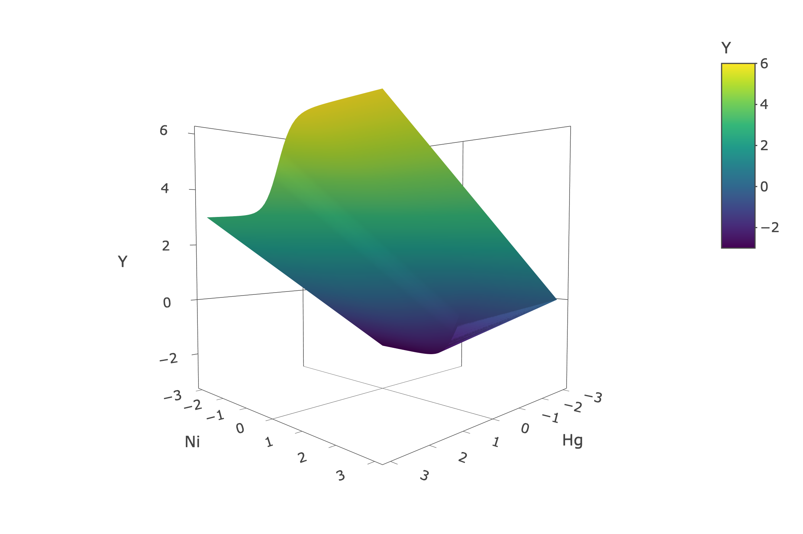
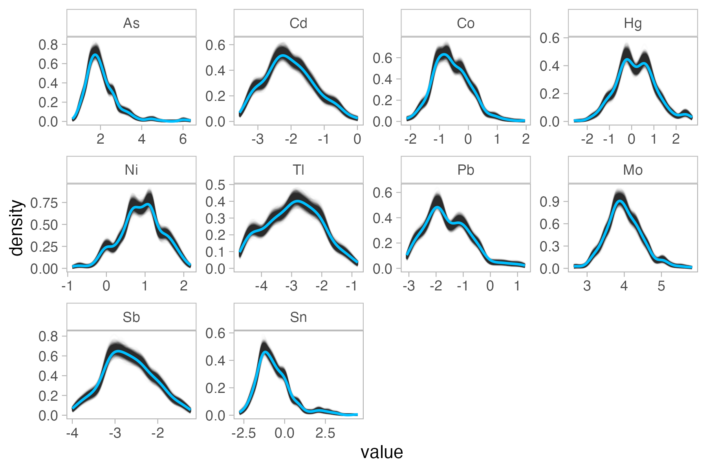
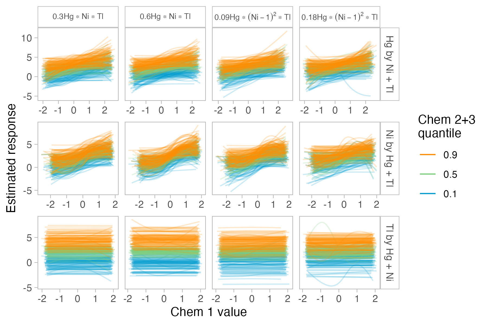

`r if(knitr:::is_latex_output()) '\\appendix'`

`r if(!knitr:::is_latex_output()) '# (APPENDIX) Appendix {-}'` 
<!--
The first appendix must start with the above text. Do not remove!
-->

```{r, include = FALSE}
# knitr::opts_chunk$set(echo = TRUE, eval = FALSE)
library(knitr)
library(kableExtra)
library(tidyverse)
```

# Supplemental output {#appa} 

This first appendix includes supplemental output for Chapter \@ref(sims). 

## Methods {#suppmethods}

Figure \@ref(fig:univlines) depicts the exposure-response relationship for univariate exposures included in all models in simulation. 

```{r univlines, fig.cap = "Exposure-response relationship for univariate exposures in all models. Exposure values are log-scaled and then standardized.", out.width = '75%', echo = F}

```


Figures \@ref(fig:basesurf)-\@ref(fig:cp2) depict the exposure-response relationship for all two-way interactions specified in the simulation study. 

```{r basesurf, fig.cap = "Exposure-response surface for base case: $Y=$ Hg $+\\frac{3}{1+\\textrm{exp}(-4\\textrm{Ni})}$.", out.width = '50%', echo = F}

```

```{r am1, fig.cap = "Exposure-response surface for a multiplicative interaction between Hg and Ni at the lower effect size: $Y=$ Hg $+\\frac{3}{1+\\textrm{exp}(-4\\textrm{Ni})}$ + 0.35Hg$*$Ni.", out.width = '50%', echo = F}
include_graphics("figures/surfaces/am1.png")
```

```{r am2, fig.cap = "Exposure-response surface for a multiplicative interaction between Hg and Ni at the higher effect size: $Y=$ Hg $+\\frac{3}{1+\\textrm{exp}(-4\\textrm{Ni})}$ + 0.7Hg$*$Ni.", out.width = '50%', echo = F}

```

```{r ap1, fig.cap = "Exposure-response surface for a polynomial interaction between Hg and Ni at the lower effect size: $Y=$ Hg $+\\frac{3}{1+\\textrm{exp}(-4\\textrm{Ni})}$ + 0.3Hg$*($Ni$-1)^2$.", out.width = '50%', echo = F}
include_graphics("figures/surfaces/ap1.png")
```

```{r ap2, fig.cap = "Exposure-response surface for a polynomial interaction between Hg and Ni at the higher effect size: $Y=$ Hg $+\\frac{3}{1+\\textrm{exp}(-4\\textrm{Ni})}$ + 0.6Hg$*($Ni$-1)^2$.", out.width = '50%', echo = F}

```

```{r bm1, fig.cap = "Exposure-response surface for a multiplicative interaction between Cd and As at the lower effect size: $Y=$ 0.35Cd$*$As.", out.width = '50%', echo = F}
include_graphics("figures/surfaces/bm1.png")
```

```{r bm2, fig.cap = "Exposure-response surface for a multiplicative interaction between Cd and As at the higher effect size: $Y=$ 0.7Cd$*$As.", out.width = '50%', echo = F}
include_graphics("figures/surfaces/bm2.png")
```

```{r bp1, fig.cap = "Exposure-response surface for a polynomial interaction between Cd and As at the lower effect size: 0.125Cd$*($As$-1)^2$.", out.width = '50%', echo = F}
include_graphics("figures/surfaces/bp1.png")
```

```{r bp2, fig.cap = "Exposure-response surface for a polynomial interaction between Cd and As at the higher effect size: 0.25Cd$*($As$-1)^2$.", out.width = '50%', echo = F}

```

```{r cm1, fig.cap = "Exposure-response surface for a multiplicative interaction between Ni and Co at the lower effect size: $Y=$ $\\frac{3}{1+\\textrm{exp}(-4\\textrm{Ni})}$ + 0.3Ni$*$Co.", out.width = '50%', echo = F}
include_graphics("figures/surfaces/cm1.png")
```

```{r cm2, fig.cap = "Exposure-response surface for a multiplicative interaction between Ni and Co at the higher effect size: $Y=$ $\\frac{3}{1+\\textrm{exp}(-4\\textrm{Ni})}$ + 0.6Ni$*$Co.", out.width = '50%', echo = F}

```

```{r cp1, fig.cap = "Exposure-response surface for a polynomial interaction between Ni and Co at the lower effect size: $Y=$ $\\frac{3}{1+\\textrm{exp}(-4\\textrm{Ni})}$ + 0.09Ni$*($Co$-1)^2$.", out.width = '50%', echo = F}
include_graphics("figures/surfaces/cp1.png")
```

```{r cp2, fig.cap = "Exposure-response surface for a polynomial interaction between Ni and Co at the lower effect size: $Y=$ $\\frac{3}{1+\\textrm{exp}(-4\\textrm{Ni})}$ + 0.18Ni$*($Co$-1)^2$.", out.width = '50%', echo = F}
include_graphics("figures/surfaces/cp2.png")
```

Figure \@ref(fig:cordistsm) shows the detailed distribution of correlations in smaller size simulated datasets. 

```{r cordistsm, fig.cap = "Distributions of Spearman's correlation from 2100 smaller size (n=252) simulated datasets.", out.width = '100%', echo = FALSE}
include_graphics("figures/ch4_corr_sim.png")
```

Figures \@ref(fig:univexplg), \@ref(fig:univcovlg), and \@ref(fig:corsimslg) compare the marginal distributions of predictors and dependence structure between exposures of the observed dataset and simulated datasets of larger size (n=1000). 

```{r univexplg, fig.cap = "Distributions of exposures from observed data (blue) and simulated larger size (n=1000) datasets (gray).", out.width = '75%', echo = FALSE}

```

```{r univcovlg, fig.cap = "Distributions of covariates from observed data (blue) and simulated larger size (n=1000) datasets (gray).", out.width = '75%', echo = FALSE}
include_graphics(path = "figures/ch4_univ_cov_sim_lg.png")
```

```{r corsimslg, fig.cap = "Spearman's correlation heat maps of exposures from observed data (a) and averaged from 2100 larger size (n=1000) simulated datasets (b), as well as distributions of correlations from larger size simulated datasets (c).", out.width = '100%', echo = FALSE}
include_graphics(path = "figures/ch4_corr_lg_simorigdens.png")
```

Figure \@ref(fig:rsqcheck) visualizes the distribution of $R^2$ values in smaller and larger size simulated datasets.

```{r rsqcheck, fig.cap = "R$^2$ values from multiple linear regressions with only the true functional form of significant exposures in smaller size (a) and larger size (b) simulated datasets.", out.width = '100%', echo = FALSE}
include_graphics(path = "figures/chem_rsq.png")
```


Figure \@ref(fig:comparedf) compares the degrees of freedom selected using the WAIC criterion when fitting BSR using 5,000 MCMC iterations to 50,000 MCMC iterations. We ran this test on five smaller size datasets from the 16 scenarios containing interactions between exposures, as well as from the base case. 

```{r comparedf, fig.cap = "Test comparing WAIC selection of degrees of freedom from BSR models fit with either 5,000 or 50,000 MCMC iterations.", out.width = '100%', echo = FALSE}
include_graphics(path = "figures/test_waic2.png")
```

<!-- Here, we describe the formula for calculating the confidence interval of the difference in difference of the estimated response at the 0.75 and 0.25 quantiles of one chemical, while holding one or two other chemicals at their 0.75 and 0.25 quantiles and the rest of the chemicals at their 0.5 quantiles.  -->

```{r traceplots, fig.cap = "Examples of trace plots from smaller size BKMR (a) and BSR (b) as well as larger size BKMR (c) and BSR (d) in scenarios with larger effect size interactions between Hg and Ni.", echo = FALSE, out.width = '100%'}
include_graphics(path = "figures/traceplots/bksm_traceplotmerged.png")
```

Finally, we show why the order of chemicals in the confidence intervals we use to assess two-way interactions in BKMR is arbitrary. Let $\widehat{Y}(X1_a,X2_b)$ be the estimated response at the $a$th quantile of $X1$, the first chemical, the $b$th quantile of $X2$, the second chemical, while holding all other chemicals at their 0.5 quantiles. Then, the estimated confidence interval of the difference in the response $X_1$'s 0.75 and 0.25 quantiles, at both the 0.75 and 0.25 quantiles of $X_2$, can be shown to be equivalent to swapping the order of $X1$ and $X2$: 

\begin{multline}
[\widehat{Y}(X1_{0.75},X2_{0.75})-\widehat{Y}(X1_{0.25},X2_{0.75})] - [\widehat{Y}(X1_{0.75},X2_{0.25})-\widehat{Y}(X1_{0.25},X2_{0.25})] \\
= \widehat{Y}(X1_{0.75},X2_{0.75})-\widehat{Y}(X1_{0.25},X2_{0.75}) - \widehat{Y}(X1_{0.75},X2_{0.25})+\widehat{Y}(X1_{0.25},X2_{0.25}) \\
= \widehat{Y}(X1_{0.75},X2_{0.75})- \widehat{Y}(X1_{0.75},X2_{0.25})
-\widehat{Y}(X1_{0.25},X2_{0.75}) +\widehat{Y}(X1_{0.25},X2_{0.25}) \\
= [\widehat{Y}(X1_{0.75},X2_{0.75})-\widehat{Y}(X1_{0.75},X2_{0.25})] - [\widehat{Y}(X1_{0.25},X2_{0.75})-\widehat{Y}(X1_{0.25},X2_{0.25})].
  (\#eq:confinteq)
\end{multline}


<!-- $$[\widehat{Y}(X1_{0.75},X2_{0.75})-\widehat{Y}(X1_{0.25},X2_{0.75})] - [\widehat{Y}(X1_{0.75},X2_{0.25})-\widehat{Y}(X1_{0.25},X2_{0.25})]$$ -->

<!-- $$=\widehat{Y}(X1_{0.75},X2_{0.75})-\widehat{Y}(X1_{0.25},X2_{0.75}) - \widehat{Y}(X1_{0.75},X2_{0.25})+\widehat{Y}(X1_{0.25},X2_{0.25})$$.  -->

<!-- $$\widehat{Y}(X1_{0.75},X2_{0.75})- \widehat{Y}(X1_{0.75},X2_{0.25}) -->
<!-- -\widehat{Y}(X1_{0.25},X2_{0.75}) +\widehat{Y}(X1_{0.25},X2_{0.25})$$ -->

<!-- This is equivalent to swapping $X_1$ and $X_2$: $[\widehat{Y}(X1_{0.75},X2_{0.75})-\widehat{Y}(X1_{0.75},X2_{0.25})] - [\widehat{Y}(X1_{0.25},X2_{0.75})-\widehat{Y}(X1_{0.25},X2_{0.25})]$ -->

## Results {#suppresults}

Figures \@ref(fig:nsmunivp)-\@ref(fig:slgunivp) display the full distributions of univariate p-values and PIPs for all models in scenarios with interactions between chemicals that were not included in Chapter \@ref(univsenschap). 

```{r nsmunivp, fig.cap = "P-value distributions of univariate chemicals from naive MLRs run on smaller size (n=252) datasets, in all scenarios with interactions between chemicals. Detection rates are displayed above a point-range with the median and first and third quartiles.", out.width = '80%', echo = FALSE}
# naive small
include_graphics(path = "figures/ch4_nsm_univ_pval.png")
```


```{r nlgunivp, fig.cap = "P-value distributions of univariate chemicals from naive MLRs run on larger size (n=1000) datasets, in all scenarios with interactions between chemicals. Detection rates are displayed above a point-range with the median and first and third quartiles.", out.width = '80%', echo = FALSE}
# naive large
include_graphics(path = "figures/ch4_nlg_univ_pval.png")
```


```{r osmunivp, fig.cap = "P-value distributions of univariate chemicals from oracle MLRs run on smaller size (n=252) datasets, in all scenarios with interactions between chemicals. Sensitivities are displayed above a point-range with the median and first and third quartiles.", out.width = '80%', echo = FALSE}
# oracle small
include_graphics(path = "figures/ch4_osm_univ_pval.png")
```


```{r olgunivp, fig.cap = "P-value distributions of univariate chemicals from oracle MLRs run on larger size (n=1000) datasets, in all scenarios with interactions between chemicals. Sensitivities are displayed above a point-range with the median and first and third quartiles.", out.width = '80%', echo = FALSE}
# oracle large
include_graphics(path = "figures/ch4_olg_univ_pval.png")
```


```{r ksmunivp, fig.cap = "PIP distributions of univariate chemicals from BKMR models run on smaller size (n=252) datasets, in all scenarios with interactions between chemicals. Detection rates are displayed above a point-range with the median and first and third quartiles.", out.width = '80%', echo = FALSE}
# bkmr small
include_graphics(path = "figures/ch4_ksm_univ_pips.png")
```


```{r klgunivp, fig.cap = "PIP distributions of univariate chemicals from BKMR models run on larger size (n=1000) datasets, in all scenarios with interactions between chemicals. Detection rates are displayed above a point-range with the median and first and third quartiles.", out.width = '80%', echo = FALSE}
# bkmr large
include_graphics(path = "figures/ch4_klg_univ_pips.png")
```


```{r ssmunivp, fig.cap = "PIP distributions of univariate chemicals from BSR models run on smaller size (n=252) datasets, in all scenarios with interactions between chemicals. Detection rates are displayed above a point-range with the median and first and third quartiles.", out.width = '80%', echo = FALSE}
# bsr small
include_graphics(path = "figures/ch4_ssm_univ_pips.png")
```


```{r slgunivp, fig.cap = "PIP distributions of univariate chemicals from BSR models run on larger size (n=252) datasets, in all scenarios with interactions between chemicals. Detection rates are displayed above a point-range with the median and first and third quartiles.", out.width = '80%', echo = FALSE}
# bsr large
include_graphics(path = "figures/ch4_slg_univ_pips.png")
```

Figures \@ref(fig:osmbivp) and \@ref(fig:olgbivp) display the full p-value distributions on interaction terms between chemicals in the oracle MLR models. 

```{r osmbivp, fig.cap = "P-value distributions of interaction terms from oracle MLRs run on smaller size (n=252) datasets, from all scenarios with interactions between chemicals.", out.width = '80%', echo = FALSE}
# oracle small
include_graphics(path = "figures/ch4_osm_biv_pval.png")
```

```{r olgbivp, fig.cap = "P-value distributions of interaction terms from oracle MLRs run on larger size (n=1000) datasets, from all scenarios with interactions between chemicals.", out.width = '80%', echo = FALSE}
include_graphics(path = "figures/ch4_olg_biv_pval.png")
```

Table \@ref(tab:onewaytabfdr) summarizes the sensitivities and false discovery rates for univariate terms in scenarios with interactions between chemicals. 


```{r onewaytabfdr, echo = FALSE, message = FALSE}
naive_sens <- read_csv("data/naive_sens.csv")
oracle_sens <- read_csv("data/oracle_sens.csv")
bkmr_sens <- read_csv("data/bkmr_pip_sens.csv")
bsr_sens <- read_csv("data/bsr_pip_sens.csv")

comb_sens <- bind_rows(
  rename(naive_sens, variable = var),
  filter(select(oracle_sens,-var), variable != "Int"),
  mutate(bkmr_sens, mod = "BKMR"),
  mutate(bsr_sens, mod = "BSR")
) |>
  filter(case != 1) |>
  mutate(
    variable = gsub("[^[:alpha:]]", "", variable),
    mod = factor(mod, levels = c("Naive MLR", "Oracle MLR", "BKMR", "BSR")) ,
    sign = ifelse(mod == "Oracle MLR", TRUE, sign),
    new_sign = factor(ifelse(
      variable %in% c("Hg", "Ni", "Sb", "Sn"),
      "Sen",
      "FDR"
    ), levels = c("Sen", "FDR")), 
    cond = case_when(
      case %in% 2:5 ~ "Hg-Ni",
      case %in% 6:9 ~ "Cd-As",
      case %in% 10:13 ~ "Ni-Co", 
      .default = "Hg-Ni-Tl"
    ),
    cond = factor(cond, levels = c("Hg-Ni", "Cd-As", "Ni-Co", "Hg-Ni-Tl")), 
    inter_type = ifelse(case %% 4 %in% 1:2, "Mult.", "Poly."),
    effect_size = factor(
      ifelse(case %% 2 == 1, "Higher", "Lower"),
      levels = c("Lower", "Higher")
    )
  ) |>
  group_by(cond, inter_type, effect_size, mod, size, new_sign) |> 
  summarize(detection = mean(sensitivity)) |> 
  arrange(new_sign, desc(size)) |> 
  pivot_wider(names_from = c(mod, size, new_sign), values_from = detection, 
              names_sep = " ") |> 
  ungroup()

comb_sens_ord <- table(comb_sens$cond)

# false discovery rates
comb_sens |> 
  select(-cond) |>
  select(c(1, 2, 11:16)) |> 
  kbl(booktabs = TRUE, digits = 2, #align = "lcc",
      caption = "Overall false discovery rate for univariate chemicals in all scenarios with interactions between chemicals.", 
      col.names = c("Type", "Effect size", 
                    rep(c("Naive", "BKMR", "BSR"), 2))
      ) |> 
  add_header_above(header = c(" " = 2, "Small" = 3, "Large" = 3)) |>
  # add_header_above(header = c(" " = 2, "Sensitivity" = 8, "False discovery rate" = 6)) |> 
  pack_rows(index = comb_sens_ord) 
```

Figures \@ref(fig:ksmcdas)-\@ref(fig:slgtri) display the estimated exposure-response surface for one chemical while fixing one (or two, for three-way interactions) other chemicals at their 0.1, 0.5, and 0.9 quantiles, for all scenarios not included in Chapter \@ref(univsenschap).

```{r ksmcdas, fig.cap = "Exposure-response relationships estimated by BKMR in smaller size (n=252) datasets, using the first chemical fixed at quantiles of another to assess interactions between Cd and As. All other chemicals are fixed at 0.5 quantiles.", out.width = '80%', echo = FALSE}
include_graphics(path = "figures/ch4_ksm_biv_expresp_2.png")
```

```{r ssmcdas, fig.cap = "Exposure-response relationships estimated by BSR in smaller size (n=252) datasets, using the first chemical fixed at quantiles of another to assess interactions between Cd and As. All other chemicals are fixed at 0.5 quantiles.", out.width = '80%', echo = FALSE}
include_graphics(path = "figures/ch4_ssm_biv_expresp_2.png")
```

```{r klgcdas, fig.cap = "Exposure-response relationships estimated by BKMR in larger size (n=1000) datasets, using the first chemical fixed at quantiles of another to assess interactions between Cd and As. All other chemicals are fixed at 0.5 quantiles.", out.width = '80%', echo = FALSE}

```


```{r slgcdas, fig.cap = "Exposure-response relationships estimated by BSR in larger size (n=1000) datasets, using the first chemical fixed at quantiles of another to assess interactions between Cd and As. All other chemicals are fixed at 0.5 quantiles.", out.width = '80%', echo = FALSE}

```


```{r ksmnico, fig.cap = "Exposure-response relationships estimated by BKMR in smaller size (n=252) datasets, using the first chemical fixed at quantiles of another to assess interactions between Ni and Co. All other chemicals are fixed at 0.5 quantiles.", out.width = '80%', echo = FALSE}

```

```{r ssmnico, fig.cap = "Exposure-response relationships estimated by BSR in smaller size (n=252) datasets, using the first chemical fixed at quantiles of another to assess interactions between Ni and Co. All other chemicals are fixed at 0.5 quantiles.", out.width = '80%', echo = FALSE}

```

```{r klgnico, fig.cap = "Exposure-response relationships estimated by BKMR in larger size (n=1000) datasets, using the first chemical fixed at quantiles of another to assess interactions between Ni and Co. All other chemicals are fixed at 0.5 quantiles.", out.width = '80%', echo = FALSE}

```


```{r slgnico, fig.cap = "Exposure-response relationships estimated by BSR in larger size (n=1000) datasets, using the first chemical fixed at quantiles of another to assess interactions between Ni and Co. All other chemicals are fixed at 0.5 quantiles.", out.width = '80%', echo = FALSE}

```


```{r ksmtri, fig.cap = "Exposure-response relationships estimated by BKMR in smaller size (n=252) datasets, using the first chemical fixed at quantiles of two others to assess interactions between Ni, Hg, and Tl. All other chemicals are fixed at 0.5 quantiles.", out.width = '80%', echo = FALSE}

```

```{r ssmtri, fig.cap = "Exposure-response relationships estimated by BSR in smaller size (n=252) datasets, using the first chemical fixed at quantiles of two others to assess interactions between Ni, Hg, and Tl. All other chemicals are fixed at 0.5 quantiles.", out.width = '80%', echo = FALSE}

```

```{r klgtri, fig.cap = "Exposure-response relationships estimated by BKMR in larger size (n=1000) datasets, using the first chemical fixed at quantiles of two others to assess interactions between Ni, Hg, and Tl. All other chemicals are fixed at 0.5 quantiles.", out.width = '80%', echo = FALSE}

```


```{r slgtri, fig.cap = "Exposure-response relationships estimated by BSR in larger size (n=1000) datasets, using the first chemical fixed at quantiles of two others to assess interactions between Ni, Hg, and Tl. All other chemicals are fixed at 0.5 quantiles.", out.width = '80%', echo = FALSE}

```

Table \@ref(tab:reunivsens) summarizes the sensitivities for Hg in scenarios with interactions between the categorical race covariate and Hg. Note that the naive and oracle MLRs do not have an associated race category, because we did not stratify them in our analysis. 

```{r reunivsens, echo = FALSE, message = FALSE}
# read in data
naive_re_sens <- read_csv("data/naive_re_sens.csv") |> 
  filter(var == "Hg") |> 
  select(-sign, -var)
oracle_re_sens <- read_csv("data/oracle_re_sens.csv") |> 
  filter(variable == "Hg") |> 
  group_by(size, case) |> 
  summarize(sensitivity = sum(p<0.05)/n())
bkmr_re_pips <- read_csv("data/bkmr_re_pips.csv") |> 
  rename(sensitivity = hg_detect) |> 
  select(-num_na)
bsr_re_pips <- read_csv("data/bsr_re_pips.csv") |> 
  filter(size != "Large" | race != 6) |> 
  rename(sensitivity = hg_detect) |> 
  select(-num_na)

# combine together
univ_re_comb <- bind_rows(
  naive_re_sens, 
  mutate(oracle_re_sens, mod = "Oracle MLR"), 
  mutate(bkmr_re_pips, mod = "BKMR"), 
  mutate(bsr_re_pips, mod = "BSR")
)

# pivot wider
univ_re_wide <- univ_re_comb |> 
  arrange(desc(size)) |> 
  pivot_wider(names_from = case, values_from = sensitivity) |> 
  mutate(
    which_race = gsub("Hispanic", "Hisp.", which_race), 
    race = ifelse(is.na(which_race), NA, 
                  paste0(which_race, " (n=", size_race, ")"))
  ) |> 
  select(-which_race, -size_race) |> 
  relocate(size)

# print
univre_ord <- table(univ_re_wide$size)[c(2, 1)]
options(knitr.kable.NA = '-')

univ_re_wide |> 
  select(-size) |> 
  kbl(booktabs = TRUE, escape = FALSE, 
      align = "llcccc", 
      caption = "Sensitivity for the univariate Hg term in all scenarios with an interaction between the categorical race covariate and Hg. Sensitivities for BKMR and BSR models are stratified by race.", 
      col.names = c("Model", "Race", rep(c("Lower", "Higher"), 2))
      ) |> 
  add_header_above(header = c(" " = 2, "Small race cat." = 2, "Large race cat." = 2), bold = TRUE) |>
  pack_rows(index = univre_ord) |> 
  collapse_rows(columns = 1, valign = "middle", latex_hline = "linespace")
```

