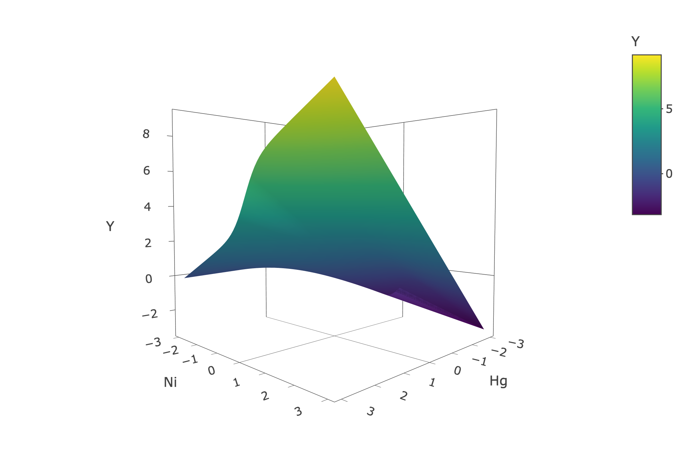
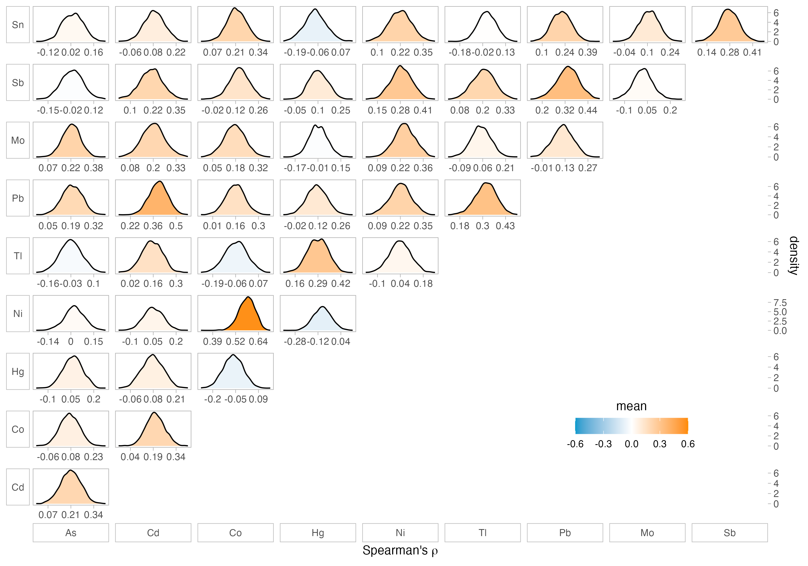

`r if(knitr:::is_latex_output()) '\\appendix'`

`r if(!knitr:::is_latex_output()) '# (APPENDIX) Appendix {-}'` 
<!--
The first appendix must start with the above text. Do not remove!
-->

```{r, include = FALSE}
# knitr::opts_chunk$set(echo = TRUE, eval = FALSE)
library(knitr)
```

# Supplemental output {#appa} 

This first appendix includes supplemental output for Chapter \@ref(sims). 

## Methods {#suppmethods}

Figure \@ref(fig:univlines) depicts the exposure-response relationship for univariate exposures included in all models in simulation. 

```{r univlines, fig.cap = "Exposure-response relationship for univariate exposures in all models. Exposure values are log-scaled and then standardized.", out.width = '75%', echo = F}
include_graphics("figures/univariatelines.png")
```


Figures \@ref(fig:basesurf)-\@ref(fig:cp2) depict the exposure-response relationship for all two-way interactions specified in the simulation study. 

```{r basesurf, fig.cap = "Exposure-response surface for base case: $Y=$ Hg $+\\frac{3}{1+\\textrm{exp}(-4\\textrm{Ni})}$.", out.width = '50%', echo = F}
include_graphics("figures/surfaces/p00.png")
```

```{r am1, fig.cap = "Exposure-response surface for a multiplicative interaction between Hg and Ni at the lower effect size: $Y=$ Hg $+\\frac{3}{1+\\textrm{exp}(-4\\textrm{Ni})}$ + 0.35Hg$*$Ni.", out.width = '50%', echo = F}

```

```{r am2, fig.cap = "Exposure-response surface for a multiplicative interaction between Hg and Ni at the higher effect size: $Y=$ Hg $+\\frac{3}{1+\\textrm{exp}(-4\\textrm{Ni})}$ + 0.7Hg$*$Ni.", out.width = '50%', echo = F}
include_graphics("figures/surfaces/am2.png")
```

```{r ap1, fig.cap = "Exposure-response surface for a polynomial interaction between Hg and Ni at the lower effect size: $Y=$ Hg $+\\frac{3}{1+\\textrm{exp}(-4\\textrm{Ni})}$ + 0.3Hg$*($Ni$-1)^2$.", out.width = '50%', echo = F}
include_graphics("figures/surfaces/ap1.png")
```

```{r ap2, fig.cap = "Exposure-response surface for a polynomial interaction between Hg and Ni at the higher effect size: $Y=$ Hg $+\\frac{3}{1+\\textrm{exp}(-4\\textrm{Ni})}$ + 0.6Hg$*($Ni$-1)^2$.", out.width = '50%', echo = F}
include_graphics("figures/surfaces/ap2.png")
```

```{r bm1, fig.cap = "Exposure-response surface for a multiplicative interaction between Cd and As at the lower effect size: $Y=$ 0.35Cd$*$As.", out.width = '50%', echo = F}
include_graphics("figures/surfaces/bm1.png")
```

```{r bm2, fig.cap = "Exposure-response surface for a multiplicative interaction between Cd and As at the higher effect size: $Y=$ 0.7Cd$*$As.", out.width = '50%', echo = F}
include_graphics("figures/surfaces/bm2.png")
```

```{r bp1, fig.cap = "Exposure-response surface for a polynomial interaction between Cd and As at the lower effect size: 0.125Cd$*($As$-1)^2$.", out.width = '50%', echo = F}
include_graphics("figures/surfaces/bp1.png")
```

```{r bp2, fig.cap = "Exposure-response surface for a polynomial interaction between Cd and As at the higher effect size: 0.25Cd$*($As$-1)^2$.", out.width = '50%', echo = F}
include_graphics("figures/surfaces/bp2.png")
```

```{r cm1, fig.cap = "Exposure-response surface for a multiplicative interaction between Ni and Co at the lower effect size: $Y=$ $\\frac{3}{1+\\textrm{exp}(-4\\textrm{Ni})}$ + 0.3Ni$*$Co.", out.width = '50%', echo = F}
include_graphics("figures/surfaces/cm1.png")
```

```{r cm2, fig.cap = "Exposure-response surface for a multiplicative interaction between Ni and Co at the higher effect size: $Y=$ $\\frac{3}{1+\\textrm{exp}(-4\\textrm{Ni})}$ + 0.6Ni$*$Co.", out.width = '50%', echo = F}
include_graphics("figures/surfaces/cm2.png")
```

```{r cp1, fig.cap = "Exposure-response surface for a polynomial interaction between Ni and Co at the lower effect size: $Y=$ $\\frac{3}{1+\\textrm{exp}(-4\\textrm{Ni})}$ + 0.09Ni$*($Co$-1)^2$.", out.width = '50%', echo = F}
include_graphics("figures/surfaces/cp1.png")
```

```{r cp2, fig.cap = "Exposure-response surface for a polynomial interaction between Ni and Co at the lower effect size: $Y=$ $\\frac{3}{1+\\textrm{exp}(-4\\textrm{Ni})}$ + 0.18Ni$*($Co$-1)^2$.", out.width = '50%', echo = F}

```

Figure \@ref(fig:cordistsm) shows the detailed distribution of correlations in smaller size simulated datasets. 

```{r cordistsm, fig.cap = "Distributions of Spearman's correlation from 2100 smaller size (n=252) simulated datasets.", out.width = '100%', echo = FALSE}

```

Figures \@ref(fig:univexplg), \@ref(fig:univcovlg), and \@ref(fig:corsimslg) compare the marginal distributions of predictors and dependence structure between exposures of the observed dataset and simulated datasets of larger size (n=1000). 

```{r univexplg, fig.cap = "Distributions of exposures from observed data (blue) and simulated larger size (n=1000) datasets (gray).", out.width = '75%', echo = FALSE}
include_graphics("figures/ch4_univ_exp_sim_lg.png")
```

```{r univcovlg, fig.cap = "Distributions of covariates from observed data (blue) and simulated larger size (n=1000) datasets (gray).", out.width = '75%', echo = FALSE}
include_graphics(path = "figures/ch4_univ_cov_sim_lg.png")
```

```{r corsimslg, fig.cap = "Spearman's correlation heat maps of exposures from observed data (a) and averaged from 2100 larger size (n=1000) simulated datasets (b), as well as distributions of correlations from larger size simulated datasets (c).", out.width = '100%', echo = FALSE}
include_graphics(path = "figures/ch4_corr_lg_simorigdens.png")
```

Figure \@ref(fig:rsqcheck) visualizes the distribution of $R^2$ values in smaller and larger size simulated datasets.

```{r rsqcheck, fig.cap = "R$^2$ values from multiple linear regressions with only the true functional form of significant exposures in smaller size (a) and larger size (b) simulated datasets.", out.width = '100%', echo = FALSE}
include_graphics(path = "figures/chem_rsq.png")
```


Figure \@ref(fig:comparedf) compares the degrees of freedom selected using the WAIC criterion when fitting BSR using 5,000 MCMC iterations to 50,000 MCMC iterations. We ran this test on five smaller size datasets from the 16 scenarios containing interactions between exposures, as well as from the base case. 

```{r comparedf, fig.cap = "compare df.", out.width = '100%', echo = FALSE}
include_graphics(path = "figures/test_waic2.png")
```

Here, we describe the formula for calculating the confidence interval of the difference in difference of the estimated response at the 0.75 and 0.25 quantiles of one chemical, while holding one or two other chemicals at their 0.75 and 0.25 quantiles and the rest of the chemicals at their 0.5 quantiles. 

[*figure this out at some points??*]


## Results {#suppresults}

Full output from a representative base-case model, two-way interaction model, and race$\times$exp interaction model. 

Potentially also include line plots of h() and f() function fits. 

Examples of trace plots for BKMR and BSR. 